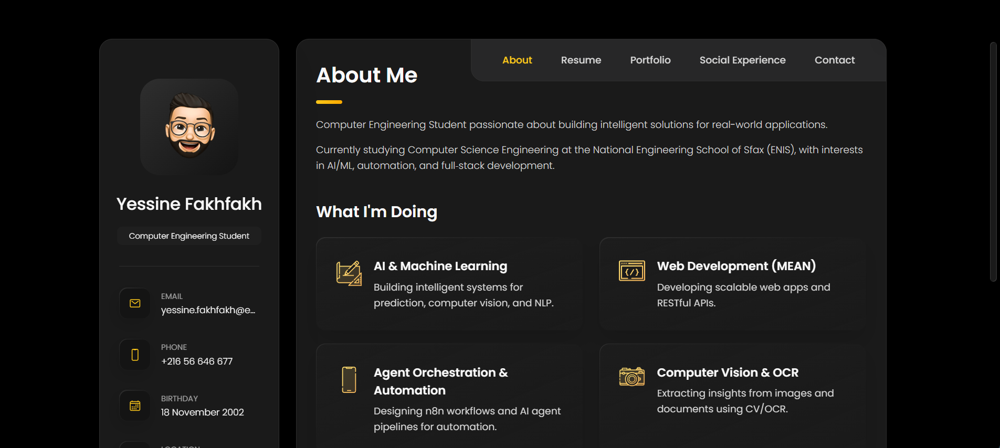

# Yessine Portfolio


Personal portfolio of Yessine Fakhfakh — Computer Engineering Student. Built with HTML, CSS, and JavaScript. Fully responsive and optimized for quick content updates.

> Note: This site is adapted from the vCard template with content, sections, and interactions customized for my profile.

## Live Demo

- GitHub Pages (if enabled): https://yessine18.github.io/yessine-portfolio

## Screenshots


## Features

- About, Resume (Education, Experience), and Skills
- Portfolio with category filters and external links (GitHub, Drive, Video)
- Social Experience and Achievements pages (portfolio-style grids with filter)
- Contact section with map and form UI
- CV View (Drive preview) and Download (direct link)

## Tech Stack

- HTML5, CSS3, Vanilla JavaScript
- Ionicons for icons

## Getting Started

Clone the repository and open `index.html` in your browser:

```bash
git clone https://github.com/yessine18/yessine-portfolio.git
cd yessine-portfolio
```

On Windows, you can double-click `index.html` to open it. For a simple local server:

```bash
# Python 3
python -m http.server 8080
# then open http://localhost:8080
```

## Customize Content

- Main content: `index.html`
- Styles: `assets/css/style.css`
- Scripts (filters, navigation, link handling): `assets/js/script.js`
- Images: `assets/images/*`

Common edits:
- Update profile, contact, and About text (sidebar + About section)
- Add/edit Portfolio items (look for `<ul class="project-list">` blocks)
- Wire project links via `data-url` on each `.project-item` (eye icon opens in a new tab)
- Update CV buttons (View = Drive preview URL, Download = `uc?export=download&id=...`)

## Deploy

Using GitHub Pages:
1. Push to GitHub (main branch)
2. Repo Settings → Pages → Deploy from a branch: `main` / root
3. Your site will be available at `https://<username>.github.io/<repo>`

## Contact

- Email: yessine.fakhfakh@enis.tn
- LinkedIn: https://www.linkedin.com/in/yessine-fakhfakh-470145298/
- GitHub: https://github.com/yessine18

## License

MIT
